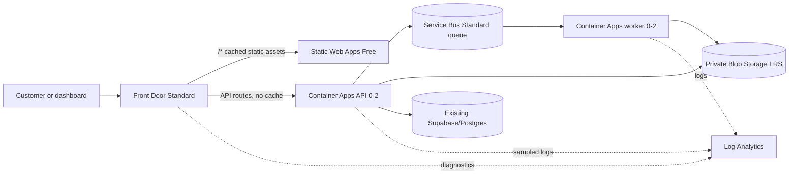

# Azure Pillar 1 Architecture

## Lean staging topology

APIM Consumption is parameterized but disabled in staging because `rate-limit-by-key` is unsupported. The direct-origin fallback is required by the approved design brief and is documented in `apim-consumption-compatibility.md`.

## Staging controls

- Front Door Standard redirects HTTP to HTTPS, probes both origins, caches the frontend route, never caches API routes, forwards correlation/edge headers, and uses a Detection-mode custom WAF policy.
- The custom WAF policy contains an API rate-limit rule and unexpected-method logging. It contains no Microsoft-managed rule set.
- The API validates the exact `X-Azure-FDID` and Front Door marker before serving non-probe paths. It also applies temporary organization/IP throttling, a 1 MiB request limit, 60-second timeout, exact CORS origins, and standardized errors.
- API and worker use 0.25 vCPU/0.5 GiB and scale from zero to two replicas. The worker has no ingress and a 60-second termination grace period.
- Service Bus Standard is retained because Basic does not support duplicate detection. Application-level idempotency remains mandatory.
- Blob containers are private, use OAuth/managed identity, retain deleted data for 14 days, and delete only `workflow-artifacts/temporary/` objects after 14 days.
- Static Web Apps Free is staging-only and has no production SLA.
- Log Analytics retains 30 days, uses a 0.5 GB/day emergency cap, and receives sampled successful-request logs without bodies, authorization headers, cookies, prompts, or responses.

Scale-to-zero can cause cold starts and must be reconsidered before production.

## Production option

`production.bicepparam` preserves the upgrade path: Front Door Premium with Microsoft-managed WAF rule sets, APIM Standard with `rate-limit-by-key`, Static Web Apps Standard, ACR Standard, zone-redundant storage, and nonzero minimum replicas. It is a recommendation only and must not be deployed from the staging workflow.

## Boundaries

Software resources target only `rg-software-staging`. Existing Nexora resources, Render, Supabase schema/data, and production DNS are outside the template. Render remains the live fallback and no live Azure connection is claimed.
