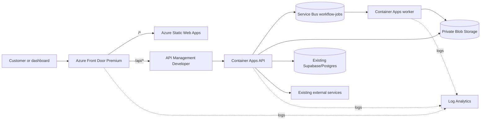

# Azure Pillar 1 Architecture

## Staging topology

## Design decisions

- Central India is the common Indian region for Container Apps, ACR, Service Bus, Storage, APIM, and Log Analytics.
- Static Web Apps is deployed in East Asia because no Indian Static Web Apps location is available.
- Front Door Premium is required for Microsoft managed WAF rules. WAF begins in Detection mode.
- APIM Developer is the least expensive staging tier that supports the required key-based rate-limit policy. It has no SLA and is not a production recommendation.
- Supabase remains the primary database. Pillar 1 does not migrate or recreate it.
- API and worker use separate user-assigned identities. The worker has no ingress.
- API Management and the API share a backend header secret; APIM also validates the exact `X-Azure-FDID` generated by the deployed Front Door profile.
- The Container App hostname exposes only health, version, and OpenAPI without the APIM backend header.

## Resource boundaries

All resources are created in a dedicated `rg-software-staging-<suffix>` resource group. Existing Nexora resources and the Render service are outside the deployment scope and remain unchanged.

## Data boundaries

Queue messages contain identifiers and job payloads but reject sensitive key names. Blob names are rooted under `organizations/<organization>/projects/<project>/...`, and the API derives paths from authenticated request context rather than accepting arbitrary blob paths.
