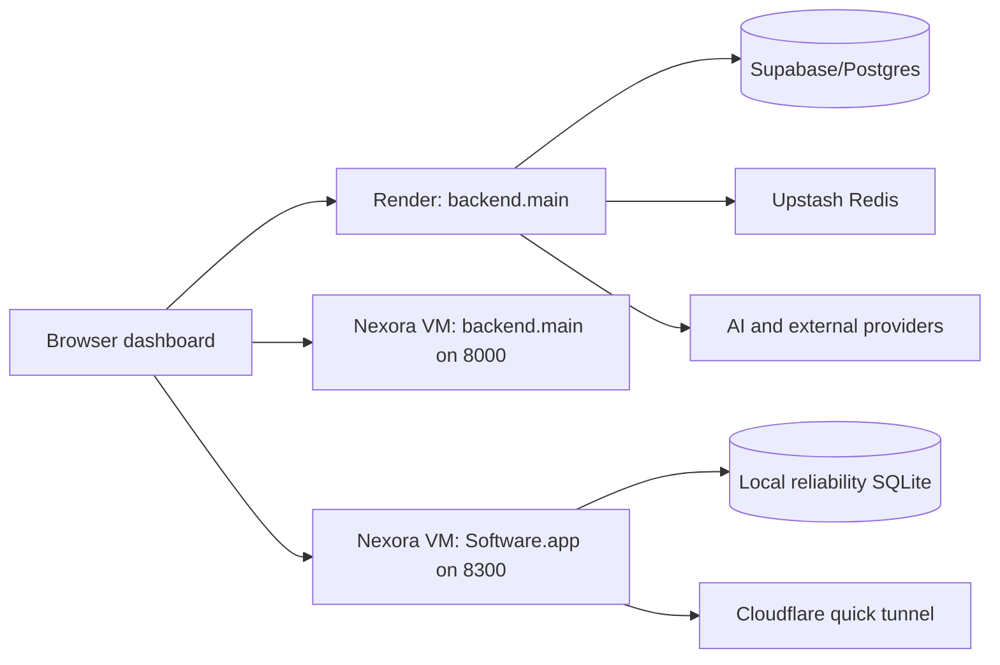

# Azure Pillar 1 Audit

Audit date: 2026-07-12  
Branch: `infra/azure-pillar-1`  
Scope: repository, current Render deployment configuration, and the currently authenticated Azure subscription.

## Executive summary

The repository contains two overlapping FastAPI deployment paths:

- `backend.main:app` is the current Render entry point and preserves authentication, billing, onboarding, customer dashboard, observability, SDK, connector, and legacy Nexora routes.
- `Software.app:app` is the standalone reliability/benchmark application used by the root Dockerfile and by the Azure VM's `software-platform.service`.

The safest Pillar 1 API base is `backend.main:app`, because it is the deployment path exercised by Render and exposes the broadest current feature set. Reliability job execution should be extracted behind shared queue and worker services without replacing either existing application.

No existing Azure resource is a clean staging foundation. The running `Nexora` VM is shared by Nexora and Software and must remain untouched. A new, isolated staging resource group is required.

The requested managed WAF rule set requires Azure Front Door Premium. Its fixed base price is approximately USD 330/month, making it an explicit approval gate before provisioning.

## Current application architecture

### FastAPI entry points

| Entry point | Deployment path | Current purpose |
|---|---|---|
| `backend.main:app` | `render.yaml`, `Procfile`, legacy Dockerfile | Main application, auth, billing, SDK, onboarding, dashboard, observability, and legacy functionality |
| `Software.app:app` | Root `Dockerfile`, Azure VM service | Reliability dashboard, benchmark APIs, external tester, SDK workflow events |
| `main:app` | Legacy root module | Monolithic legacy application retained for compatibility |

## Repository structure

- `backend/`: current modular FastAPI application and route packages.
- `backend/routes/`: auth, billing, benchmark, connector, dashboard, health, onboarding, project, reliability, SDK, settings, and static routes.
- `Software/`: reliability engine, dashboard, benchmark runners, reports, and local SQLite databases.
- `frontend/`: current dashboard and public HTML/JavaScript UI. No frontend build toolchain currently exists.
- `software_sdk/`: Python monitoring SDK.
- `tests/`: auth, dashboard, observability, onboarding, database, PostHog, and security tests.
- `agent-chaos-lab/`, `cascade-guard/`, `agent-failure-contract/`: related experimental tools that are outside the Pillar 1 runtime.
- `.github/workflows/`: absent; there is no current GitHub Actions deployment workflow.

The worktree contained extensive pre-existing modified and untracked files before Pillar 1 began. Pillar 1 commits must stage only explicitly owned files.

## Existing routes and runtime behavior

The backend includes health, authentication, billing, onboarding, dashboard, observability, connector, benchmark, reliability, SDK, project, and settings route groups. `backend.main` also exports legacy symbols from `backend.runtime`, preserving older routes.

The existing `/health` endpoint performs database, Supabase, Redis, local storage, and SDK checks. The requested `/health/live`, `/health/ready`, and build-aware `/version` endpoints are missing from `backend.main`. OpenAPI remains available through FastAPI's default `/openapi.json`.

The standalone Software application already has `/health` and `/version`, but production startup intentionally rejects its SQLite storage. It does not yet provide a Supabase/Postgres persistence adapter for all reliability tables.

## Frontend

The frontend is static HTML and JavaScript, not a compiled SPA. It uses same-origin relative API calls in most views, with several localhost fallbacks in `frontend/index.html`. Static Web Apps deployment therefore needs a runtime-generated public configuration file or a consistent `window.API_BASE`, plus route fallback and security headers. The UI must be copied unchanged.

## Benchmarks and worker candidates

Existing benchmark and reliability logic lives in `Software/`, including tool reliability, workflow analysis, prediction, validation, guardrail effectiveness, multi-model reliability, and real-world validation. Some runners can invoke AI or Ollama and must not run during smoke tests. Pillar 1 should initially support a safe, explicitly allow-listed staging job handler rather than exposing arbitrary module execution.

## External dependencies

| Service | Current integration | Pillar 1 treatment |
|---|---|---|
| Supabase | Auth, project URL, anon/service-role keys, Postgres `DATABASE_URL` | Preserve as the production database; no Azure migration |
| Upstash Redis | REST URL/token, rate-limit state | Preserve through secure Container Apps secrets |
| Qdrant | Optional external-test memory integration | Preserve placeholder; do not recreate |
| Sentry | Optional external-test exception capture | Preserve placeholder; do not recreate |
| PostHog | Server/browser analytics and AI observability | Preserve with prompt/response capture disabled |
| Clerk | Optional auth configuration | Preserve placeholders |
| AI providers | Ollama, Pollinations, Groq, Gemini, OpenRouter, Hugging Face, Parallel | Preserve configuration; no paid calls in tests |

The Supabase July 2026 changelog includes relevant security and platform changes: new tables may not be exposed automatically through Data/GraphQL APIs, anon-key OpenAPI access has changed, and `pg_graphql` defaults changed. Pillar 1 does not create Supabase tables; any later schema work must explicitly verify grants and RLS.

## Current deployment paths

| Target | Configuration | Status/risk |
|---|---|---|
| Render | `render.yaml`: `backend.main:app` | Must remain unchanged; public URL could not be independently verified from this environment |
| Root Docker | `Dockerfile`: `Software.app:app` | Copies reliability databases and generated data unless excluded; production SQLite startup fails |
| Azure VM | systemd services for Nexora and Software | Shared VM; cannot be deallocated as Nexora-only infrastructure |
| Docker Compose | `docker-compose.yml` | Uses local SQLite volume and is development-oriented |

## Azure subscription audit

Subscription display name: `Azure subscription 1`  
Subscription ID: partially masked in operational reports only.

The subscription currently contains 17 resources:

- VMs: `Nexora` (running, shared Nexora/Software), `Nexora-Dev` (deallocated).
- Managed disks: two 30 GB Premium P4 Linux OS disks and one unattached 127 GB Premium P10 Windows disk.
- Network: three NICs, three Standard static public IPs, three NSGs, one VNet, and Network Watcher.
- Other: one SSH public-key resource.
- No ACR, Container Apps, Service Bus, APIM, Static Web Apps, Front Door, Blob Storage account, Key Vault, Application Insights, or Log Analytics workspace exists.

All existing resources are Nexora-owned or Azure-managed and must remain untouched.

## Region analysis

`centralindia` supports Container Apps, Container Apps environments, ACR, Service Bus, Storage, APIM, and Log Analytics in the authenticated subscription's provider metadata. It is selected for Pillar 1 regional resources because it satisfies the regional service intersection and is close to Indian users.

Azure Static Web Apps is not offered in an Indian region according to current provider metadata. Its supported locations are Central US, East US 2, West US 2, West Europe, and East Asia. The staging Static Web App must therefore use `eastasia`, the closest supported option, while Azure Front Door remains a global resource.

## Required Azure resources

- Dedicated staging resource group.
- Basic private Azure Container Registry.
- Log Analytics workspace.
- Consumption Azure Container Apps environment.
- Externally reachable API Container App with managed identity.
- Internal worker Container App with queue scaling and managed identity.
- Standard Service Bus namespace and `workflow-jobs` queue.
- StorageV2 LRS account and four private blob containers.
- Free staging Static Web App in East Asia.
- Consumption API Management instance in Central India.
- Azure Front Door Premium profile, endpoint, routes, WAF policy, and diagnostics.
- User-assigned identities and least-privilege data-plane role assignments.

Key Vault is intentionally deferred to Pillar 2 by the attached specification. Pillar 1 secrets must use Container Apps secret references or existing approved secret storage without committing values.

## Fixed-cost estimate and approval gate

Current public retail estimates, before tax, discounts, data transfer, and usage:

| Resource | Estimated fixed cost/month |
|---|---:|
| Azure Front Door Premium | USD 330.00 |
| Service Bus Standard base | USD 10.00 |
| ACR Basic | approximately USD 5.00 |
| APIM Consumption | USD 0 fixed; first usage tier is metered |
| Static Web Apps Free | USD 0 |
| Container Apps Consumption | USD 0 fixed; usage after free grant |
| Log Analytics | USD 0 fixed; ingestion above allowance is metered |
| Blob Storage | usage-based, approximately USD 0.011/GB-month for Cool LRS data |
| **Minimum predictable fixed cost** | **approximately USD 345/month** |

Front Door Standard costs approximately USD 35/month but does not support the required managed WAF rule set. Premium is therefore required to implement the attached specification as written. No Front Door resource should be provisioned until this cost is explicitly approved.

## Security risks

- `backend.main` configures wildcard CORS together with credentials, which is unsafe and incompatible with the target controls.
- Existing NSGs expose SSH, API, RDP, and Ollama-related ports broadly.
- The running VM hosts both Nexora and Software, creating shared-failure and ownership risk.
- Existing Software public access uses an ephemeral Cloudflare quick tunnel.
- The root Dockerfile can copy local databases, reports, logs, and `.env`-adjacent artifacts into images.
- The standalone Software app uses SQLite and cannot meet multi-replica production requirements.
- Several frontend localhost fallbacks can bypass the intended Front Door path.
- No current CI/CD, OIDC federation, ACR, managed identity, WAF, APIM, or private worker boundary exists.
- Render health and deployed environment variables could not be verified with the available authentication.
- The repository contains multiple copy files and conflicting deployment definitions, creating naming and release ambiguity.

## Missing production components

- Durable queue abstraction and validated message envelope.
- Independent worker runtime, idempotency store, retry/dead-letter policy, and graceful shutdown.
- Managed-identity Blob abstraction with tenant-safe object paths.
- Non-root deterministic API and worker images.
- Restricted CORS and build metadata endpoints.
- Bicep modules, deployment scripts, OIDC workflow, smoke tests, and rollback automation.
- Front Door/APIM origin validation and correlation-ID propagation.
- Production persistence adapter for standalone Software reliability tables.

## Safe reuse decisions

- Reuse Supabase as the primary database.
- Reuse existing application code, frontend assets, tests, and Render deployment as rollback paths.
- Do not reuse the Nexora resource group, VM, VNet, NSGs, public IPs, NICs, or managed disks.
- Network Watcher remains Azure-managed and requires no Pillar 1 change.
- No existing ACR, Service Bus, storage, APIM, Front Door, Static Web App, or Container Apps environment is available for reuse.

## Audit conclusion

Pillar 1 can be prepared safely in code and Bicep on `infra/azure-pillar-1`. Provisioning must pause for explicit approval of the approximately USD 345/month fixed staging baseline, primarily caused by the required Front Door Premium managed WAF capability. Production DNS, Render, Nexora resources, and customer traffic must remain unchanged.
